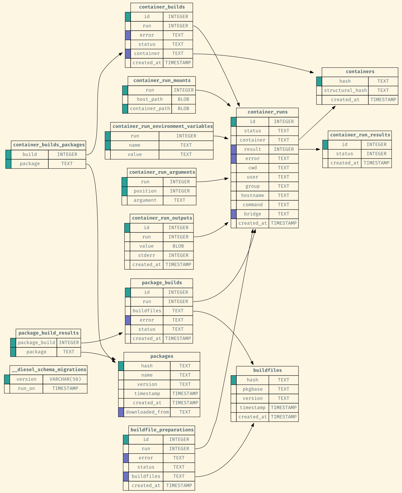

# Visualize an sqlite database

Create simple visualizations of sqlite databases in GraphViz `dot` format.

```bash
visualize-sqlite your_sqlite_database.db | dot -Tpng -Gfontname='Fira Mono' -Gfontcolor='#586e75' -Gbgcolor='#fdf6e3' -Nfontname='Fira Mono' -Nfontcolor='#586e75' -Efontname='Fira Mono' > output.png
```

**Example:**

